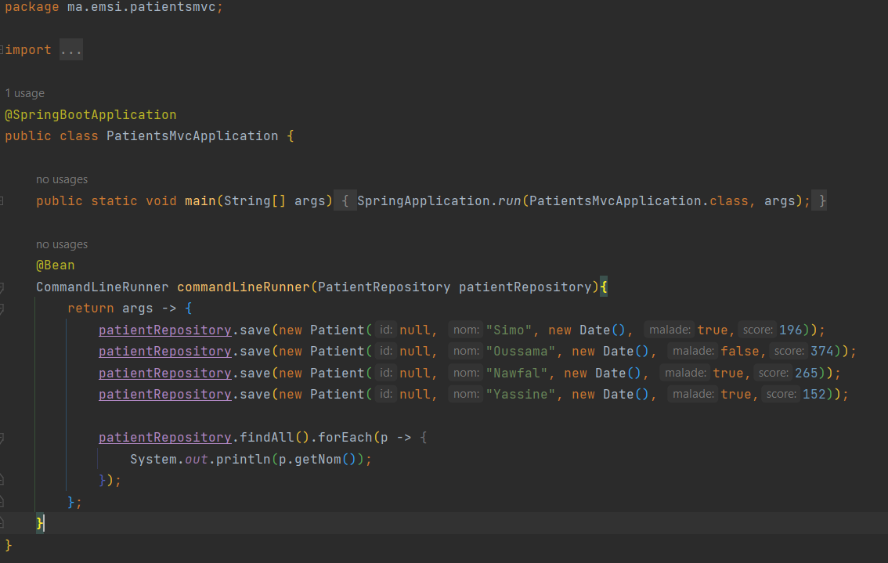
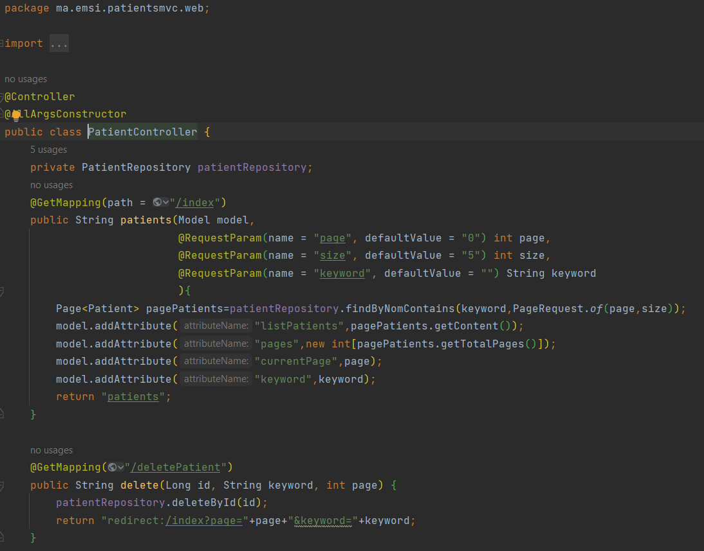
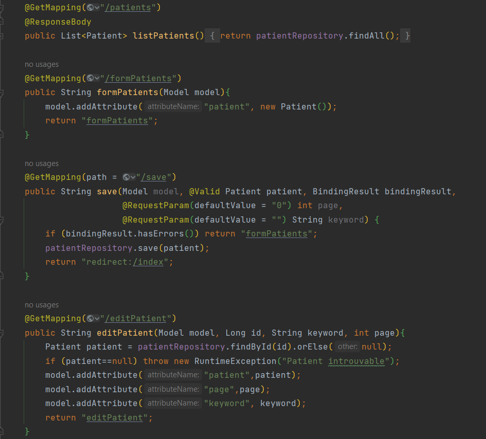
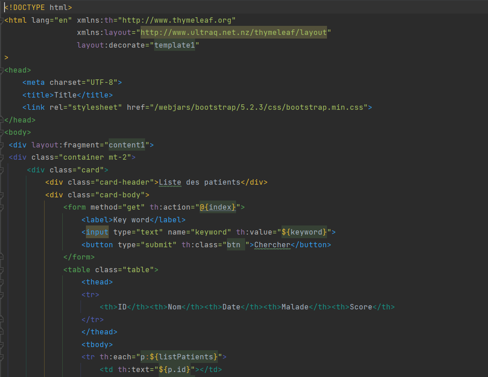
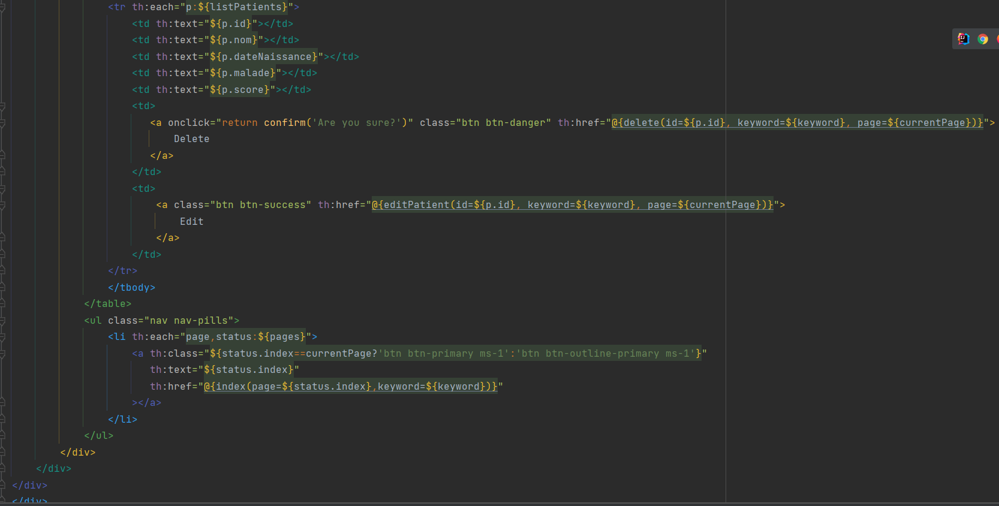
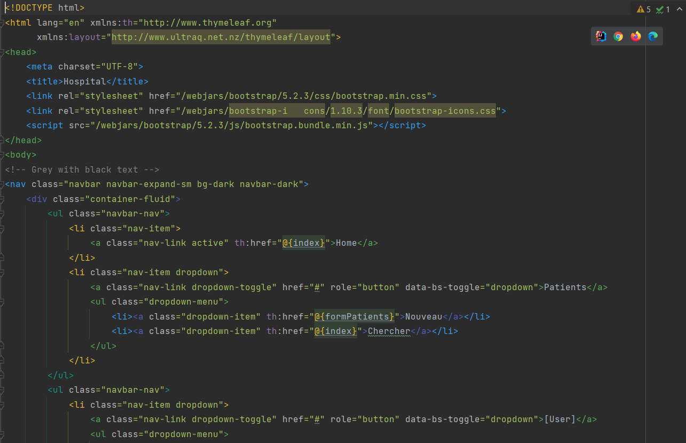
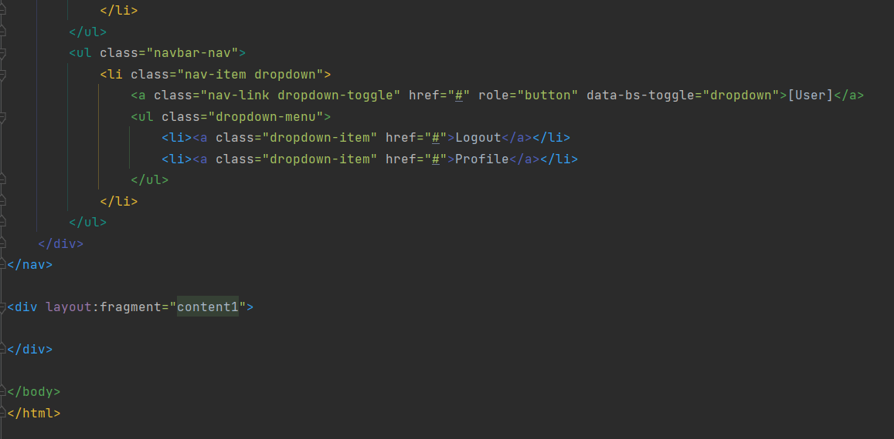
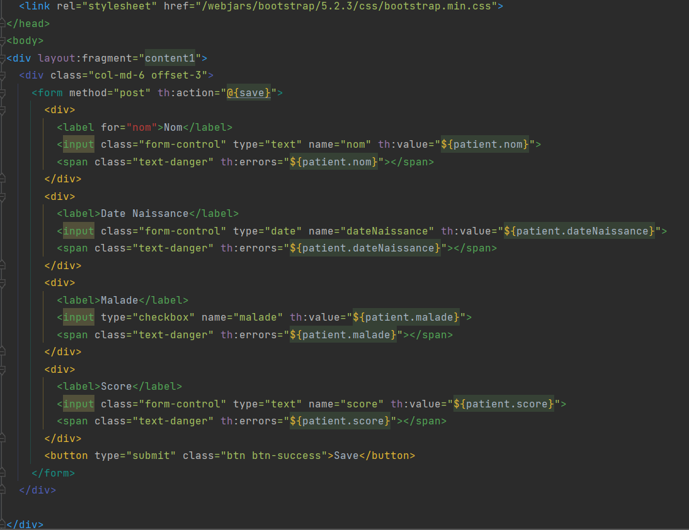
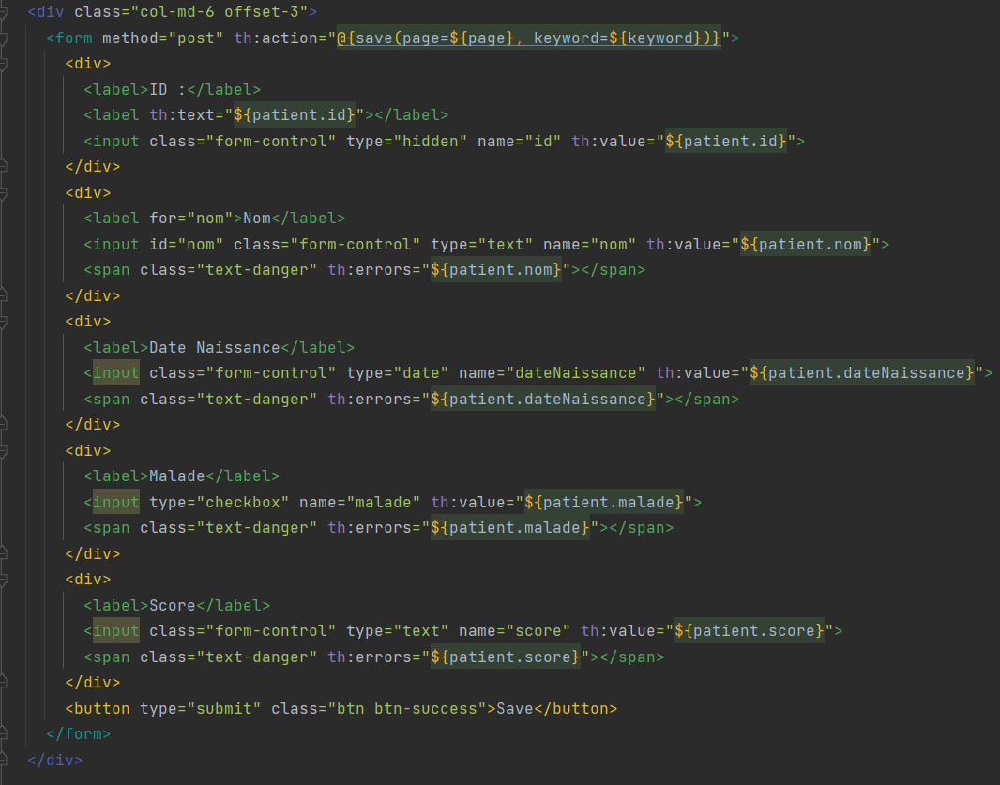

<h1> Spring MVC using Thymeleaf </h1>

<h5> 1. Afficher les patients 
2. Faire la pagination 
3. Chercher les patients 
4. Supprimer un patient 
5. Faire des améliorations supplémentaires</h5>

 
<h5>PatientsMvcApplicatiion.java</h5>

<h5>PatientsController.java</h5>

<h5>patients.HTML</h5>

<h5> template.HTML </h5>

<h5>formPatient.HTML</h5>

<h5>editPatient.HTML</h5>

